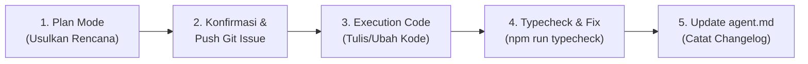

# AGENT.MD — PANDUAN KONTEKS & PROTOKOL PENGEMBANGAN JOGJAHUB

Dokumen ini adalah sumber kebenaran (*Single Source of Truth*) dan referensi konteks persisten bagi AI Agent (dan developer) dalam memelihara serta mengembangkan ekosistem **JogjaHub**.

---

## 1. Konteks Bisnis & PRD Ringkas

### 1.1 Latar Belakang & Problem Statement
Yogyakarta adalah kota pelajar dengan ribuan wisudawan per periode wisuda. Mahasiswa sering menghadapi:
1. Antrean dini hari tanpa kepastian untuk layanan kecantikan (MUA, salon, penataan rambut).
2. Ketiadaan kepastian ukuran/model busana wisuda di butik.
3. Kesulitan keluarga dari luar kota dalam mencari penginapan terdekat dari kampus.
4. Kebutuhan *gifting* (selempang, plakat, buket bunga, akrilik) yang terpisah-pisah.

**JogjaHub** adalah platform agregator mobile satu pintu yang mengintegrasikan tiga kategori utama:
- **Beauty & Style** (Salon, MUA, Butik)
- **Hotel / Penginapan**
- **Gifting** (Florist, Selempang, Plakat, Akrilik)

### 1.2 Aktor Sistem (Multi-Role)
1. **Customer** (Mahasiswa/Keluarga): Menjelajahi katalog, melihat lokasi vendor di peta, memilih slot waktu (termasuk slot dini hari), melakukan booking, mengunggah bukti bayar manual, membatalkan pesanan (sesuai ketentuan), dan memberi ulasan.
2. **Vendor / Tenant**: Mendaftar, melengkapi profil bisnis & kategori layanan, mengelola katalog produk/layanan, mengelola jadwal/slot waktu, menerima atau menolak pesanan masuk, serta memantau omzet/performa.
3. **Admin**: Memverifikasi & *approve/reject* pendaftaran vendor baru, memantau transaksi, serta menangani pengaduan/kualitas layanan.

### 1.3 Batasan Ruang Lingkup MVP (3 Bulan)
- **IN-SCOPE**:
  - Autentikasi Multi-Role terpisah (`Customer`, `Vendor`, `Admin`).
  - Onboarding & Approval Vendor (`pending` $\rightarrow$ `approved` / `rejected`).
  - Kategori, Sub-kategori, dan Filter Spesifik.
  - Integrasi Peta Lokasi (pinpoint vendor DIY).
  - Sistem Pemesanan Berbasis Slot Waktu (*Time Slot Capacity* dengan pencegahan overbooking/race condition).
  - Manajemen Pesanan (Vendor: Konfirmasi/Tolak; Customer: List Booking & Batalkan).
  - Pembayaran Manual (Transfer rekening + Unggah bukti bayar atau COD / Pay on Arrival).
- **OUT-OF-SCOPE (Jangan Diimplementasikan di MVP)**:
  - **Live Chat / Direct Messaging In-App**: **Ditiadakan**. Komunikasi langsung dialihkan ke **WhatsApp** eksternal vendor.
  - **Payment Gateway Otomatis** (Midtrans, Xendit, dll.): **Ditiadakan** untuk versi MVP.
  - **Multi-Bahasa & Multi-Mata Uang**: Hanya Bahasa Indonesia & Rupiah (IDR).
  - **Loyalty Program / Kupon Promo**: Ditunda ke versi pasca-MVP.

---

## 2. Arsitektur Teknis & Stack

### 2.1 Mobile App (`jogjahub-mobile`)
- **Framework**: React Native + Expo (Expo SDK 54 / React 19 / React Native 0.81).
- **Arsitektur Folder**: *Feature-Driven Architecture* (`src/features/{auth,customer,vendor,admin,shared}`).
- **Navigasi**: React Navigation v6 (`@react-navigation/native-stack`, `@react-navigation/bottom-tabs`).
- **State Management**: Redux Toolkit (`@reduxjs/toolkit`, `react-redux`).
- **Styling**: React Native `StyleSheet` murni dengan token desain konsisten (`src/constants/theme/`).
- **HTTP Client**: Axios (`src/api/client.ts`) dengan Interceptor Bearer Token Sanctum.
- **Penyimpanan Sesi**: `@react-native-async-storage/async-storage` (wajib persisten).

### 2.2 Backend (`jogjahub-backend`)
- **Framework**: PHP 8.3 + Laravel 11.x.
- **Database**: MySQL 8.0.
- **Autentikasi API**: Laravel Sanctum (token-based).
- **Role RBAC**: `customer`, `tenant` (vendor), `admin`.
- **Fitur Kritis**: `lockForUpdate()` saat booking untuk mencegah *race condition* slot dini hari.
- **Upload File**: Disimpan di `storage/app/public` melalui FormRequest multipart.

---

## 3. Peta Folder & Status Implementasi

```
JogjaHub/
├── agent.md                        # Panduan AI, workflow, dan riwayat pembaruan
├── prd-jogjahub.md                 # PRD utama
├── frontend-guideline-jogjahub.md  # Panduan frontend
├── backend-guideline-jogjahub.md   # Panduan backend
├── erd-diagram.md                  # Skema database relasional
├── Roadmap_Backend_JogjaHub.md     # Roadmap sprint backend
│
├── jogjahub-backend/               # REST API Laravel 11
│   ├── app/Http/Controllers/Api/   # Controller per role (Customer, Tenant, Admin, Auth)
│   ├── app/Services/BookingService # Business logic booking & slot capacity locking
│   ├── routes/api.php              # Route API v1 (auth, categories, tenants, services, bookings)
│   └── database/migrations/        # Migrasi tabel database
│
└── jogjahub-mobile/                # Aplikasi Mobile React Native (Expo)
    └── src/
        ├── api/                    # authApi, vendorApi, bookingApi, categoryApi, timeSlotApi, uploadApi
        ├── components/             # Reusable UI (Button, Input, Card, Modal, EmptyState, SlotPicker)
        ├── constants/              # theme (colors, typography, spacing), config, categories
        ├── features/
        │   ├── auth/               # [STATUS: READY] Login, Register Customer & Vendor, Role Switching
        │   ├── vendor/             # [STATUS: ~75% READY] Dashboard, Listing/CRUD Service, Incoming Orders, Calendar
        │   ├── customer/           # [STATUS: GAP BESAR]
        │   │   ├── home/           # HomeScreen (UI ada, perlu integrasi dinamis & copywriting)
        │   │   ├── catalog/        # CatalogScreen (STUB: return null)
        │   │   ├── vendor-detail/  # VendorDetailScreen (STUB: return null)
        │   │   ├── booking/        # BookingScreen & BookingConfirmationScreen (UI ready)
        │   │   ├── my-bookings/    # MyBookingsScreen & BookingDetailScreen (STUB: return null)
        │   │   └── profile/        # CustomerProfileScreen (STUB: return null)
        │   ├── admin/              # [STATUS: STUB] PendingVendors, Monitoring, Dashboard (return null)
        │   └── shared/             # Notifications, Onboarding Splash
        ├── navigation/             # RootNavigator, CustomerStackNavigator/Tab, VendorTab/Stack, AdminTab
        ├── services/               # tokenStore (perlu AsyncStorage), mapService, fileUploadService
        ├── store/                  # Redux store & authSlice
        ├── types/                  # Type definitions (user, vendor, booking, payment)
        └── utils/                  # dateHelpers, formatCurrency, orderTracking, validators
```

---

## 4. STANDAR OPERASIONAL PROSEDUR (SOP) WORKFLOW PENGEMBANGAN

Setiap AI Agent atau developer yang bekerja pada repositori ini **WAJIB** mengikuti 4 tahap berikut secara berurutan:



### Tahap 1: Plan Mode (Rencana Sebelum Koding)
- Analisis kebutuhan dan file yang akan diubah/dibuat.
- **JANGAN MENGUBAH KODE TERLEBIH DAHULU**.
- Jelaskan secara transparan kepada user:
  1. Latar belakang & tujuan perubahan.
  2. Daftar file yang akan ditambah/diubah/dihapus.
  3. Rincian logika atau UI yang akan diterapkan.
- Minta persetujuan user sebelum melangkah ke tahap berikutnya.

### Tahap 2: Push Issue ke GitHub
- Setelah rencana disepakati bersama user, buat GitHub Issue pada repositori `Gabriell550/JogjaHub` agar terdokumentasi dan dapat dilanjutkan oleh AI lain atau anggota tim.
- Format GitHub Issue:
  - **Judul**: `[Modul] Deskripsi Singkat Fitur/Fix` (contoh: `[Customer] Implementasi CatalogScreen dan Filter Sub-Kategori`)
  - **Deskripsi**: Penjelasan detail apa yang akan diubah dan tujuannya.
  - **Daftar File Terdampak**: Path file yang akan dimodifikasi atau dibuat baru.
  - **Checklist Kriteria Selesai (Definition of Done)**.
- Cara Pembuatan Issue:
  - Melalui GitHub CLI (`gh issue create`), REST API GitHub, atau link issue template.

### Tahap 3: Execution Code
- Mulai melakukan modifikasi file sesuai persetujuan.
- Ikuti standar desain dan arsitektur yang sudah ada:
  - Gunakan token tema dari `src/constants/theme` (`colors`, `typography`, `spacing`, `radius`).
  - Gunakan API instance dari `src/api/client.ts`.
  - Pastikan penamaan komponen dan file konsisten.
  - Jangan menambahkan library baru tanpa persetujuan.

### Tahap 4: Typecheck & Error Fixing
- Jalankan pemeriksaan TypeScript:
  ```bash
  cd jogjahub-mobile
  npm run typecheck
  ```
- Jika ditemukan error tipe data atau import, **langsung perbaiki (*fix it*)** sampai seluruh tipe valid.
- Pastikan tidak ada *breaking change* pada modul lain.

### Tahap 5: Update `agent.md`
- Catat pembaruan sistem atau perbaikan bug di tabel **Riwayat Perubahan & Bug Fixes** di bawah ini.

---

## 5. Riwayat Perubahan & Bug Fixes (Changelog)

| Tanggal | Modul | Deskripsi Perubahan / Bug Fix | Status | Issue Ref |
| :--- | :--- | :--- | :--- | :--- |
| 2026-09-21 | Auth (Mobile) | Persistensi sesi login dengan AsyncStorage (issue #21): `tokenStore.ts` simpan/hapus token ke `@jogjahub/token` (fire-and-forget) + tambah `loadPersistedToken()`; `authSlice.ts` tambah state `isHydrated` & reducer `restoreSession`; file baru `authListener.ts` (middleware listener → tulis/hapus `@jogjahub/session` saat `setSession`/`setTenantProfile`/`logout`); file baru `bootstrapAuth.ts` (thunk restore sesi saat app start, cleanup data korup); `RootNavigator.tsx` guard splash loading selama `isHydrated=false` + panggil `bootstrapAuth()`; `store/index.ts` pasang listener middleware. `useLogout.ts` tidak diubah (listener middleware sudah handle clear session saat logout). `npm run typecheck` → 0 error. | Selesai | #21 |
| 2026-09-20 | Auth (Mobile) | Fix bug kompilasi folder auth: commit "design page auth v1" (0fef9775) diduplica kode lama+nova di RoleSwitchTab (Pressable tanpa closing tag), AuthHeader (style key duplicat), LoginScreen & RegisterCustomerScreen (blok UI double, nesting JSX broken, brace hilang), dan shared components Button/Input/Card/FileUploadField yang dipakai screens auth. Di-rewrite bersih, pakai design nova. Frontend only (backend 0 ubah). `npm run typecheck` → 0 error. | Selesai | - |
| 2026-09-19 | Core Docs | Pembuatan `agent.md` sebagai basis konteks PRD, arsitektur, dan SOP 4 tahap pengerjaan. | Selesai | - |

---

## 6. Antrean Tugas & Prioritas Selanjutnya (Backlog Prioritas)

1. **[Auth & State] Persistensi Sesi Login**:
   - Sambungkan `tokenStore.ts` dan `authSlice.ts` ke `@react-native-async-storage/async-storage` agar token dan user info tidak hilang saat reload aplikasi.
2. **[Customer] Routing & CatalogScreen**:
   - Daftarkan layar `Catalog` dan `VendorDetail` di `CustomerStackNavigator.tsx`.
   - Bangun UI `CatalogScreen.tsx` untuk menampilkan daftar vendor dan layanan berdasarkan kategori/sub-kategori wisuda dengan filter.
3. **[Customer] VendorDetailScreen**:
   - Tampilkan informasi profil vendor, paket layanan wisuda, alamat/lokasi, dan tombol direct ke WhatsApp eksternal (sesuai aturan PRD: tanpa in-app chat).
4. **[Customer] MyBookingsScreen & BookingDetailScreen**:
   - Hubungkan ke `bookingApi.listMyBookings()` dan `bookingApi.cancelBooking()`.
5. **[Copywriting & Cleanup] Penyelarasan Istilah**:
   - Ubah terminologi di `HomeScreen.tsx` ("Renter Dashboard" & "Wisatamu") menjadi konteks resmi JogjaHub Wisuda.
   - Bersihkan peringatan `baseUrl` di `tsconfig.json`.

