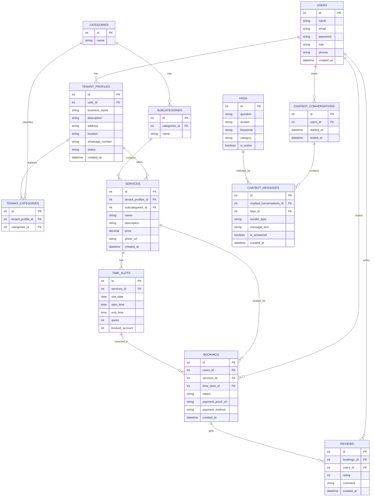

# ERD - Sistem Direktori & Booking Layanan Multi-Tenant

## Catatan Struktur

- **Domain sistem**: Direktori & booking layanan multi-tenant (marketplace jasa) dengan fitur kategori/subkategori, penjadwalan, pemesanan, ulasan, dan chatbot FAQ.
- **TENANT_CATEGORIES** adalah tabel junction (many-to-many) antara `TENANT_PROFILES` dan `CATEGORIES`.
- **CHATBOT_MESSAGES** menghubungkan percakapan dengan FAQ yang cocok — `faqs_id` kemungkinan besar nullable untuk pesan yang belum terjawab oleh FAQ (`is_answered = false`).
- **TIME_SLOTS** menyimpan kuota (`quota`) dan jumlah yang sudah dibooking (`booked_account`) untuk mengontrol ketersediaan slot.
- **BOOKINGS** menjadi penghubung utama antara `USERS`, `SERVICES`, dan `TIME_SLOTS`, sekaligus menjadi dasar untuk `REVIEWS`.
